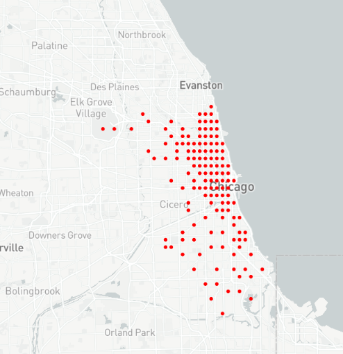
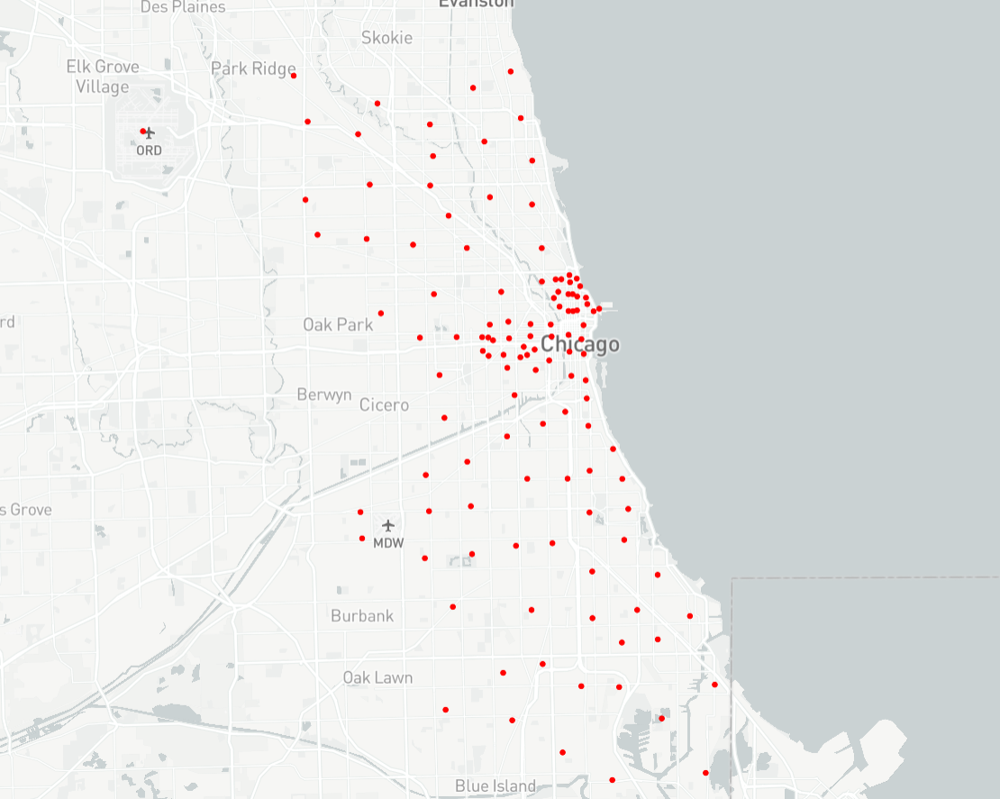
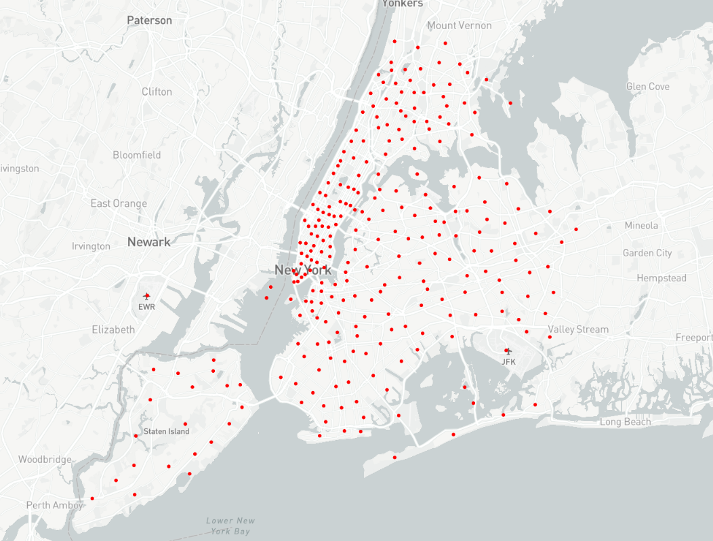

#  Welcome to UCTB datasets release pages!

## Datasets Overview

Currently, UCTB offers the following datasets in 4 scenarios, with detailed information provided in the table below. We are constantly working to release more datasets in the future.

| **Application**  |        **City**        |       Time Span       | **Interval** |                           **Link**                           |
| :--------------: | :--------------------: | :-------------------: | :----------: | :----------------------------------------------------------: |
|   Bike-sharing   |          NYC           | 2013.07.01-2017.09.30 | 5 & 60 mins  | [5 mins](https://github.com/uctb/Urban-Dataset/blob/main/Public_Datasets/Bike/5_minutes/Bike_NYC.zip)  [60 mins](https://github.com/uctb/Urban-Dataset/blob/main/Public_Datasets/Bike/60_minutes/Bike_NYC.zip) |
|   Bike-sharing   |        Chicago         | 2013.07.01-2017.09.30 | 5 & 60 mins  | [5 mins](https://github.com/uctb/Urban-Dataset/blob/main/Public_Datasets/Bike/5_minutes/Bike_Chicago.zip) [60 mins](https://github.com/uctb/Urban-Dataset/blob/main/Public_Datasets/Bike/60_minutes/Bike_Chicago.zip) |
|   Bike-sharing   |           DC           | 2013.07.01-2017.09.30 | 5 & 60 mins  | [5 mins](https://github.com/uctb/Urban-Dataset/blob/main/Public_Datasets/Bike/5_minutes/Bike_DC.zip) [60 mins](https://github.com/uctb/Urban-Dataset/blob/main/Public_Datasets/Bike/60_minutes/Bike_DC.zip) |
|  Vehicle Speed   |           LA           | 2012.03.01-2012.06.28 |    5 mins    | [5 mins](https://github.com/uctb/Urban-Dataset/blob/main/Public_Datasets/Speed/5_minutes/METR_LA.zip) |
|  Vehicle Speed   |          BAY           | 2017.01.01-2017.07.01 |    5 mins    | [5 mins](https://github.com/uctb/Urban-Dataset/blob/main/Public_Datasets/Speed/5_minutes/PEMS_BAY.zip) |
| Pedestrian Count |       Melbourne        | 2021.01.01-2022.11.01 |   60 mins    | [60 mins](https://github.com/uctb/Urban-Dataset/blob/main/Public_Datasets/Pedestrian/60_minutes/Pedestrian_Melbourne.zip) |
|   Ride-sharing   |  Chicago (community)   | 2013.01.01-2018.01.01 |   15 mins    | [15 mins](https://github.com/uctb/Urban-Dataset/blob/main/Public_Datasets/Taxi/15_minutes/Taxi_Chicago.zip) |
|   Ride-sharing   | Chicago (census tract) | 2013.01.01-2018.01.01 |   15 mins    | [15 mins](https://github.com/uctb/Urban-Dataset/blob/main/Public_Datasets/Taxi/15_minutes/Taxi_fine_grained_Chicago.zip) |
|   Ride-sharing   |          NYC           | 2009.01.01-2023.06.01 |    5 mins    | [5 mins](https://github.com/uctb/Urban-Dataset/blob/main/Public_Datasets/Taxi/5_minutes/Taxi_NYC.zip) |

## Bike Datasets

The bike-sharing datasets are collected from U.S. open data portals including New York City (NYC, https://www.citibikenyc.com/system-data), Chicago (CHI, https://www.divvybikes.com/system-data), and DC (https://www.capitalbikeshare.com/system-data). The dataset time span for all three cities is more than four years. The total number of historical flow records is around 49 million, 13 million, and 14 million in NYC, Chicago, and DC, respectively, and each record contains the start station, start time, stop station, stop time, etc. 

The following shows the map visualization of bike stations in NYC, Chicago, and DC.

  

**Data catalog**: https://github.com/uctb/Urban-Dataset/tree/main/Public_Datasets/Bike/

|   **5-minutes**   |                   **New York City**                    |                        **Chicago**                         |                        **DC**                         |
| :---------------: | :----------------------------------------------------: | :--------------------------------------------------------: | :---------------------------------------------------: |
|     TimeRange     |                 2013.07.01-2017.09.30                  |                   2013.07.01-2017.09.30                    |                 2013.07.01-2017.09.30                 |
|    TimeFitness    |                         5 mins                         |                           5 mins                           |                        5 mins                         |
| TrafficNode.shape |                     (446976, 820)                      |                       (446976, 585)                        |                     (446976, 532)                     |
| StationInfo.shape |                        [820, 5]                        |                          [585, 5]                          |                       [532, 5]                        |
| TrafficGrid.shape |                    (446976, 20, 20)                    |                      (446976, 20, 20)                      |                   (446976, 20, 20)                    |
| GridLatLng.shape  |                        [21, 2]                         |                          [21, 2]                           |                        [21, 2]                        |
|       Size        | [66.0M](./Public_Datasets/Bike/5_minutes/Bike_NYC.zip) | [30.2M](./Public_Datasets/Bike/5_minutes/Bike_Chicago.zip) | [31.0M](./Public_Datasets/Bike/5_minutes/Bike_DC.zip) |

|  **60-minutes**   |                    **New York City**                    |                         **Chicago**                         |                         **DC**                         |
| :---------------: | :-----------------------------------------------------: | :---------------------------------------------------------: | :----------------------------------------------------: |
|     TimeRange     |                  2013.07.01-2017.09.30                  |                    2013.07.01-2017.09.30                    |                 2013.07.01-2017.09.30                  |
|    TimeFitness    |                         60 mins                         |                           60 mins                           |                        60 mins                         |
| TrafficNode.shape |                      (37248, 820)                       |                        (37248, 585)                         |                      (37248, 532)                      |
| StationInfo.shape |                        [820, 5]                         |                          [585, 5]                           |                        [532, 5]                        |
| TrafficGrid.shape |                     (37248, 20, 20)                     |                       (37248, 20, 20)                       |                    (37248, 20, 20)                     |
| GridLatLng.shape  |                         [21, 2]                         |                           [21, 2]                           |                        [21, 2]                         |
|     download      | [20.5M](./Public_Datasets/Bike/60_minutes/Bike_NYC.zip) | [11.0M](./Public_Datasets/Bike/60_minutes/Bike_Chicago.zip) | [10.7M](./Public_Datasets/Bike/60_minutes/Bike_DC.zip) |

##  Speed Datasets

The two traffic speed datasets are widely used in STTP research: METR-LA and PEMS-BAY from Los Angeles (LA) County and Bay Area, respectively. In METR-LA, 207 sensors record highway vehicles’ speeds for four months; In PEMS-BAY, there are 325 sensors for six months. Each sensor can be seen as a station.

Following shows the map-visualization of METR-LA and PEMS-BAY.

  

**Data catalog**: https://github.com/uctb/Urban-Dataset/tree/main/Public_Datasets/Speed/

|   **5-minutes**   |                      **METR_LA**                       |                      **PEMS_BAY**                       |
| :---------------: | :----------------------------------------------------: | :-----------------------------------------------------: |
|     TimeRange     |                 2012.03.01-2012.06.28                  |                  2017.01.01-2017.07.01                  |
|    TimeFitness    |                         5 mins                         |                         5 mins                          |
| TrafficNode.shape |                      (34272, 207)                      |                      (52128, 325)                       |
| StationInfo.shape |                        [207,5]                         |                         [325,5]                         |
| TrafficGrid.shape |                          (0)                           |                           (0)                           |
| GridLatLng.shape  |                          [0]                           |                           [0]                           |
|       Size        | [11.8M](./Public_Datasets/Speed/5_minutes/METR_LA.zip) | [27.9M](./Public_Datasets/Speed/5_minutes/PEMS_BAY.zip) |

## Pedestrian Datasets

The pedestrian datasets are collected from [open data website of Melbourne](https://data.melbourne.vic.gov.au/Transport/Pedestrian-Counting-System-Monthly-counts-per-hour/b2ak-trbp/data). The full datasets' timespan is over 10 years and the datasets are still being updated at a fixed frequency (i.e., 60 minutes). Due to the fact that some sites were not set up in the early days and some sites lacked data, we only choose about a year in temporal dimension and 55 stations in spatial dimension. There is also accessible information about sensors on the same website. In the dataset of sensor information, we obtain the name, the sensor's ID, the sensor's status(whether it is active or not), the latitude and longtitude of each sensor.

Following shows the map-visualization of Pedestrian datasets in Melbourne.


**Data catalog**: https://github.com/uctb/Urban-Dataset/tree/main/Public_Datasets/Pedestrian


|  **60-minutes**   |                   **Pedestrain Melbourne**                   |
| :---------------: | :----------------------------------------------------------: |
|     TimeRange     |                    2021.01.01-2022.11.01                     |
|    TimeFitness    |                           60 mins                            |
| TrafficNode.shape |                         (16056, 55)                          |
| StationInfo.shape |                            [55,5]                            |
| TrafficGrid.shape |                             (0)                              |
| GridLatLng.shape  |                             [0]                              |
|       Size        | [1.18M](https://github.com/uctb/Urban-Dataset/blob/main/Public_Datasets/Pedestrian/60_minutes/Pedestrian_Melbourne.zip) |

## Taxi Datasets

The Taxi datasets are collected from the [city of Chicago's open data portal](https://data.cityofchicago.org/Transportation/Taxi-Trips/wrvz-psew) and the [city of New York's open data portal](https://opendata.cityofnewyork.us/), where you are able to freely download Chicago city's and NYC's  datasets for your own analysis. The datasets record taxi trips from these dimensions listed below: pickup and dropoff time, pickup and dropoff location, fee etc. In our dataset, we only consider the pickup info of each record. You can conduct more comprehensive analysis with the help of our datasets and the website.

### Taxi Chicago Dataset

**Facts in dataset description**

1. There are two candidate spatial discretization information: **[census tract](https://data.cityofchicago.org/Facilities-Geographic-Boundaries/Boundaries-Census-Tracts-2010/5jrd-6zik)** and **[community area](https://data.cityofchicago.org/Facilities-Geographic-Boundaries/Boundaries-Community-Areas-current-/cauq-8yn6)**.
2. For each record, it will aggregate census tract granularity into community area due to [privacy preserve](http://dev.cityofchicago.org/open%20data/data%20portal/2019/04/12/tnp-taxi-privacy.html).

**Which granularity to choose**

Thus, we need to choose a proper granularity. According to the needs of downstream tasks (Spatio-temporal traffic prediction), we summarize two principles of spatial granularity selection:

1. Spatial granularity as small as possible (especially in high-demand area).
2. Demamd aggregated due to privacy as few as possible.

On one hand, time distribution of taxi demand in downtown is dense, and the probability of being aggregated is small. on the other hand, the time distribution of taxi demand in the suburbs is sparse, and the probability of being aggregated is high.

**Final datasets we open**

We finally choose to process two datasets: one is `Taxi_Chicago`, where only spatial granularity **community area** is used; another is `Taxi_fine_grained_Chicago`, where **community area** is used in suburbs while **census tract** is used in downtown.

>We highly recommend that you conduct more analysis on **Taxi_fine_grained_Chicago**. By the way, we have adopted a special operation that taxi demand of specific census tract in 15-minute time window equal or less than 2 will be set 2. This operation won't affect much because all of aggregation situation is ultimately caused by insufficient demand.

Following shows the map-visualization of `Taxi_Chicago` datasets.



Following shows the map-visualization of `Taxi_fine_grained_Chicago` datasets.



### Taxi NYC Dataset

We collect Taxi NYC dataset from these two websites: https://opendata.cityofnewyork.us/ and https://www.nyc.gov/site/tlc/about/tlc-trip-record-data.page. We also obtain information of taxi zones in New York from this [website](https://opendata.cityofnewyork.us/). As a result of size of dataset, we put it on the [link](https://pan.baidu.com/s/19iUVCTqgAvJJf0pgHVyZMQ?pwd=gw6p) with extraction code gw6p.

Following shows the map-visualization of `Taxi_NYC` datasets.



**Data catalog**: https://github.com/uctb/Urban-Dataset/tree/main/Public_Datasets/Taxi

|  **Taxi-Demand**   |**Taxi_Chicago**|**Taxi_fine_grained_Chicago**|**Taxi_NYC**|
| :---------------: | :-------------------------------------------------------------------------------------------------------: |:---------------:|:---------------:|
|     TimeRange     |2013.01.01-2018.01.01|2013.01.01-2018.01.01|2009.01.01-2023.06.01|
|    TimeFitness    |15 mins|15 mins|5 mins|
| TrafficNode.shape |                                               (175296, 77)                                               |(175296, 121)|(779904, 263)|
| StationInfo.shape |                                                 [77,5]                                                  |[121,5]|[263,5]|
| TrafficGrid.shape |                                              (0)                                              |(0)|(0)|
| GridLatLng.shape  |                                                  [0]                                                   |[0]|[0]|
|       Size        | [6.06M](https://github.com/uctb/Urban-Dataset/blob/main/Public_Datasets/Taxi/15_minutes/Taxi_Chicago.zip) |[10.0M](https://github.com/uctb/Urban-Dataset/blob/main/Public_Datasets/Taxi/15_minutes/Taxi_fine_grained_Chicago.zip)|[36.5M](https://github.com/uctb/Urban-Dataset/blob/main/Public_Datasets/Taxi/5_minutes/Taxi_NYC.zip)|

## How to load the data?

We've collected some public datasets and processing them into [UCTB dataset format](https://uctb.github.io/UCTB/md_file/tutorial.html#build-your-own-datasets). UCTB dataset is a python build-in dictionary object that could be loaded by [pickle package](https://docs.python.org/3/library/pickle.html). Here is the example of UCTB dataset.

```python
UCTB_dataset = {
    "TimeRange": ['YYYY-MM-DD', 'YYYY-MM-DD'], # time span of datasets (e.g., 2013.07.01-2017.09.30)
    "TimeFitness": 60, # Minutes
    
    "Node": { # Designed for GNNs models, it is a dictionary that stores traffic data.
        "TrafficNode": np.array, # With shape [time, num-of-node]
        "StationInfo": list # elements in it should be [id, build-time, lat, lng, name]
    },

    "Grid": { # Designed for CNNs models, it is a dictionary that stores Grid data.
        "TrafficGrid": [], np.array, # With shape [time, num_rows, num_cols]
        "GridLatLng": [], list # It stores the geographic information of each grid.
    },

    "ExternalFeature": {} # Designed to store external features (e.g., weather), it is currently a reserved key. 
}
```

Here is the example of loading data by pickle package:

```python
import pickle
with open("Bike_NYC.pkl","rb") as fp:
    data = pickle.load(fp)
```

UCTB also provides dataloader (namely `NodeTrafficLoader` and `GridTrafficLoader`) to process data. Please see our [documents ](https://uctb.github.io/UCTB/UCTB.dataset.html)for more information.

```python
# loading Grid traffic
from UCTB.dataset import GridTrafficLoader
data_loader = GridTrafficLoader(dataset="Bike", city="NYC")


# loading Node traffic
from UCTB.dataset import NodeTrafficLoader
data_loader = NodeTrafficLoader(dataset="Bike", city="NYC")
```

## Data Loader Tutorial

For more detailed instructions of data loader, please see this [Jupyter Notebook](Tutorial/tutorial.ipynb).

## How to get the datasets at other granularities?

We could merge the fine-grained data to obtain the datasets at other granularities (e.g., by summing the 12 flows from the 5-minutes datasets to obtain 60-minutes datasets). UCTB provides the API to merge data. You could specify MergeIndex and MergeWay in the `NodeTrafficLoader` and `GridTrafficLoader`. Here is an example:


```python
from UCTB.dataset import NodeTrafficLoader

# loading 5-minutes datasets

data_loader = NodeTrafficLoader(dataset="Bike", city="NYC") 
print(data_loader.dataset.node_traffic.shape) # with shape (446976, 820)

data_loader = NodeTrafficLoader(dataset="Bike", city="NYC", MergeIndex=12, MergeWay="sum")
print(data_loader.dataset.node_traffic.shape) # with shape (37248, 820)
```
